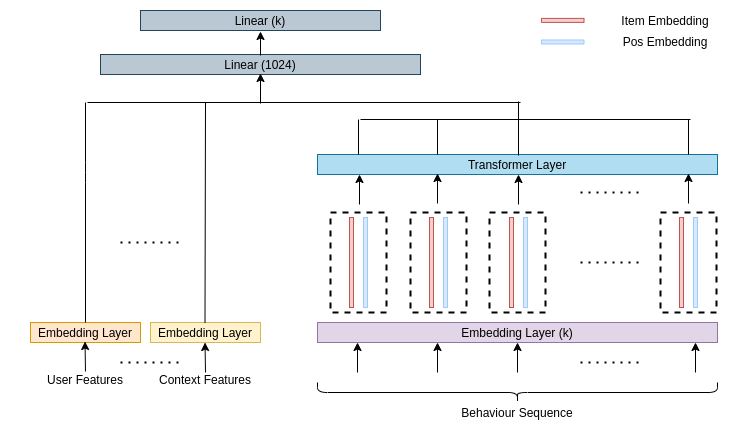

# Behaviour Sequence Transformers

Pytorch implementation of Behaviour Sequence transformer for user sequence prediction as outlined in:
[Behavior Sequence Transformer for E-commerce
Recommendation in Alibaba.](https://arxiv.org/pdf/1905.06874.pdf) 

# Notes
* Implemented as a seq-to-seq prediction problem instead of CTR prediction problem as outlined in the original paper.

# References
1. Original Paper - *Qiwei Chen, Huan Zhao, Wei Li, Pipei Huang, and Wenwu Ou. 2019. Behavior sequence transformer for e-commerce recommendation in Alibaba.* https://arxiv.org/pdf/1905.06874.pdf

2. https://github.com/DannyMerkx/next_word_prediction

